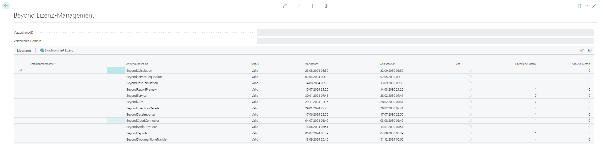

# Lizenzverwaltung

In diesem Kapitel wird beschrieben, wie Sie die Lizenzverwaltung von **Beyond Carts** einsehen können.  

Um den Status der Produktlizenz für **Beyond Carts** einzusehen, gehen Sie wie folgt vor:  

1. Öffnen Sie das Suchfeld (ALT+Q) und suchen Sie die Seite **[Beyond Lizenz-Management](https://businesscentral.dynamics.com/?page=70838792)**.  
1. Die Seite **Beyond Lizenz-Management** wird angezeigt.  
      

1. Unter dem Bereich **Lizenzen** finden Sie alle Produktlizenzen für Anwendungen von BeyondIT, die für diesen Mandanten installiert wurden. Anhand der Werte in den Spalten können Sie alle erforderlichen Informationen ablesen:  

|**Spalte**|**Beschreibung**|
|--|--|
|**Unternehmensname**|Diese Spalte gibt den Namen des Unternehmens an.|
|**Anwendungsname**|Diese Spalte gibt den Namen der Anwendung an. Wenn Sie mehrere Produkte von BeyondIT verwenden, wird für jedes Produkt eine eigene Zeile in der Übersicht angezeigt.|
|**Status**|Dies ist der Status der Produktlizenz. Es sind mehrere Wert möglich:  **Valid**: Die Produktlizenz ist gültig und die Anwendung kann ohne Einschränkungen verwendet werden. **Expired**: Die Produktlizenz ist abgelaufen. Die Anwendung kann nicht mehr verwendet werden. **Trial**: Die Produktlizenz ist gültig und Funktionalitäten der Anwendung können für einen kurzen Zeitraum (beachten Sie den Wert in der Spalte **Ablaufdatum**) beschränkt oder unbeschränkt verwendet werden.  **Exceeded**: Die Produktlizenz ist abgelaufen. Die Anwendung kann nicht mehr verwendet werden.|
|**Startdatum**|Dies ist das Datum, an dem die Produktlizenz registriert wurde.|
|**Ablaufdatum**|Dies ist das Datum, an dem die Produktlizenz ungültig wird oder wurde. Die Anwendung kann nicht weiter verwendet werden.|
|**Test**|Dieses Kontrollkästchen zeigt an, ob es sich bei der Produktlizenz um eine Testlizenz handelt. Testlizenzen sind zeitlich sehr beschränkte Lizenzen. Sie können nach Ablauf der Testlizenz eine vollwertige Produktlizenz erwerben (beachten Sie den Wert in der Spalte **Ablaufdatum**).|
|**Lizenzierte Metrik**|In dieser Spalte wird angezeigt, wie die Anwendung lizensiert wurde. Dies kann beispielsweise eine mandantenübergreifende Lizenz, eine Lizenz pro Mandant oder eine Lizenz pro Benutzer sein.|
|**Aktuelle Metrik**|In dieser Spalte wird angezeigt, wieviele Lizenzen in der Umgebung verwendet werden. Anhand der Differenz zwischen den Werten unter der Spalte **Lizenzierte Metrik** und **Aktuelle Metrik** können Sie ablesen, ob Sie eine zusätzliche Lizenz erwerben müssen.|
