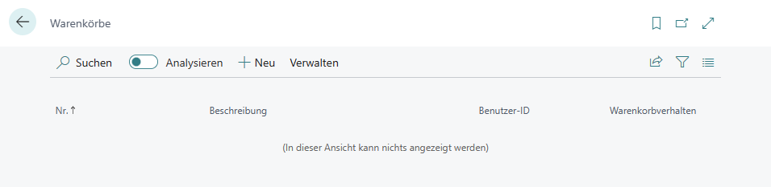
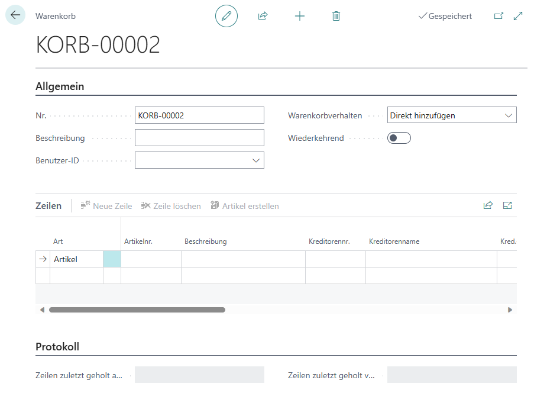

# Warenkorb erstellen

In diesem Kapitel wird beschrieben, wie Sie einen Warenkorb erstellen und Artikel odewr andere Güter in den Warenkorb legen. Weitere Informationen dazu, wie Sie aus einem oder mehreren Warenkörben eine Bestellung erstellen, erhalten Sie unter dem Kapitel [Bestellung aus Warenkörben erstellen](create-purchase-order-from-carts.md).  

Um einen Warenkorb zu erstellen, gehen Sie wie folgt vor:  

1. Rufen Sie aus dem Rollencenter die Suchfunktion auf (**ALT+Q**).  
1. Suchen Sie nach **[Warenkörbe](https://businesscentral.dynamics.com/?page=70838783)** und klicken Sie auf das entsprechende Suchergebnis.  
1. Die Seite **Warenkörbe** wird angezeigt.  
     
1. Um einen neuen Warenkorb zu erstellen, klicken Sie in der Menüleiste auf die Option **Neu**.  
1. Eine neue Warenkorbkarte wird angezeigt.  
     
1. Klicken Sie in das Feld **Beschreibung** und geben Sie eine Beschreibung für den Warenkorb an. Beachten Sie, dass die Informationen im Feld **Nr.** automatisch vom System vergeben werden, wenn Sie die Nummernserie für Warenkörbe auf der Seite **BeyondCarts Einrichtung** hinterlegt haben. Weitere Informationen zur Einrichtung erhalten Sie unter dem Kapitel [Beyond Carts einrichten](../setup/setup-beyond-carts.md).  
1. Öffnen Sie die Dropdown-Liste für das Feld **Benutzer-ID** und wählen Sie den Benutzer aus, dem dieser Warenkorb zugeordnet werden soll.  
1. Über den Wert im Feld **Standard Warenkorbverhalten** bestimmen Sie, wie die Artikel in den Warenkorb hinzugefügt werden. Die folgenden Werte sind möglich:  
    + Bei der Option **Direkt hinzufügen** werden die Positionszeilen direkt aus dem Beleg mit der entsprechenden Menge in den Warenkorb hinzugefügt.  
    + Bei der Option **Benutzereingabe** werden Sie bei dem Übertrag der Positionszeilen in den Warenkorb dazu aufgefordert, die Artikelmenge und weitere Informationen anzugeben.  
1. Über den Schieberegler **Wiederkehrend** können Sie definieren, ob der Warenkorb wiederkehrend angezeigt wird, d.h. die Zeilen aus dem Warenkorb werden nicht gelöscht, wenn die Zeilen in eine Bestellung übertragen wurden und werden, wenn eine neue Bestellung ausgelöst wird, erneut angezeigt. Sie können die Einstellung auch für einzelne Artikelzeilen vornehmen, aktivieren Sie dazu bei bereits vorhandenen Artikelzeilen das Kontrollkästchen **Wiederkehrend**.  
1. Unter dem Bereich **Zeilen** werden die im Warenkorb enthaltenen Artikelzeilen angezeigt. Da der Warenkorb neu erstellt wurde, werden in diesem Bereich noch keine Zeilen angezeigt.  
1. Unter dem Bereich **Protokoll** werden Informationen zum Benutzer und dem Zeitstempel angezeigt, ab dem dieser Datensatz beispielsweise für eine Bestellung abgerufen wurde.  

Sie haben einen Warenkorb erstellt. Unter dem Kapitel [Artikel zum Warenkorb hinzufügen](add-items-to-cart.md) erhalten Sie weitere Informationen dazu, wie Sie den Warenkorb mit Artikelzeilen füllen.  